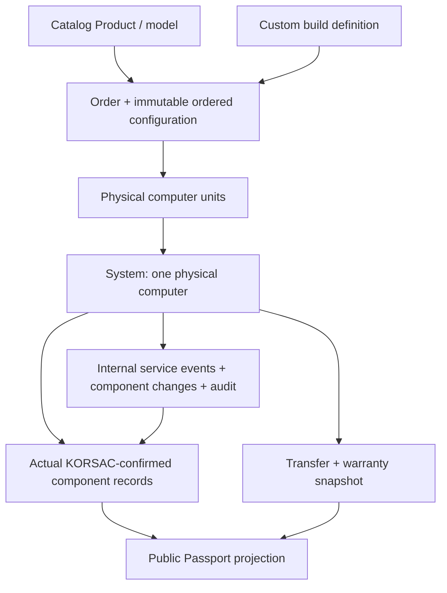

# KORSAC — System Passport Experience v1

Base: PR #12 merged into `main`, `01219297b9af159102feaa95d9e9569659642310`.
This stage defines the physical-system domain and its public projection. The
HTML, forms and dates are review fixtures. No Bitrix/D7 module, database,
order automation, identity/QR generator, warranty service, support submission,
authentication or persistence is implemented.

## Entity chain and ownership

A **System** is one concrete computer, independent of Product, Order, basket
line, configuration choice, account, customer and public page. Passport is a
projection, not the central stored entity. A 2028 catalog configuration must
not rewrite the confirmed components or warranty of a System assembled in 2026. Order configuration is an immutable expected snapshot; physical
installation requires a separate staff confirmation.

One order can create several Systems. For PLAY 1440 × 2 plus monitor × 1,
create KS-2610-0012 and KS-2610-0013 for the two computer units; create no System
for the monitor. Three identical computers need three Systems, and different
computer lines also expand per unit. Product classification comes from
backend-owned computer/ordinary-product metadata, not labels or SKU spelling.

Stable relation: `ORDER_ID + ORDER_BASKET_ID + ORDER_UNIT_INDEX`, or an
equivalent immutable physical-unit key. Enforce uniqueness for that relation;
never treat Order → System as one-to-one. Unit identity must survive retries
and legitimate order updates. Already-created units are not renumbered or
silently deleted when quantity/product labels change. Unit reconciliation,
cancellation and exceptional edits are audited backend operations.

`SYSTEM_TYPE = MODEL | CUSTOM`. `MODEL_REFERENCE` is optional; a CUSTOM
System is «Индивидуальная сборка» without needing a catalog model.
`MODEL_DISPLAY_NAME` is a System snapshot. The same domain supports PLAY,
CREATE, WORK and CUSTOM. No `USER_ID` is required. Future private «Мои системы»
can link an account to Systems; resale does not rotate machine identifiers or
require public passport ownership transfer. Account is out of scope.

## Identifiers and QR

| Value               | Meaning / source                                  | Invariant                                                    |
| ------------------- | ------------------------------------------------- | ------------------------------------------------------------ |
| Internal System key | Future domain persistence                         | Never trust a public browser field for this relation         |
| SYSTEM_ID           | Human identifier, e.g. `KS-2610-0012`             | Immutable, unique, never reused, assigned at System creation |
| PUBLIC_ID           | Public locator                                    | Immutable, unique, unpredictable; assigned at preparation    |
| QR                  | Derived representation of approved production URL | Can be regenerated without changing PUBLIC_ID                |

SYSTEM_ID: `KS` / creation year `YY` / month `MM` / monthly sequence `NNNN`.
Sequence starts at 0001 each month; cancelled Systems retain numbers. Future
backend allocates atomically through a monthly counter/sequence mechanism
with locks or equivalent atomic increment and a unique DB constraint.
**Never use `COUNT(*) + 1`.** Gaps are acceptable; published/reserved identities
must not be recycled. Timezone, overflow beyond the illustrated four-digit
format and operational allocation policy must be fixed before backend rollout.
The identifier can help operators estimate age, but is never a warranty source.

PUBLIC_ID uses cryptographically secure random **128 bits**, conceptually
`bin2hex(random_bytes(16))` in PHP. Do not derive it from SYSTEM_ID, dates,
customer/order data or `MD5(date + time + secret)`. Enforce a unique constraint;
handle a rare collision only while allocating a previously unassigned token.
The normal admin UI cannot regenerate it. The browser never generates either
identity. The internal example `8f9ab671c60345244f08ed310f912b8d` is an authored
synthetic shape, not a generated token or reachable production address.

Production `/passport/{PUBLIC_ID}/` uses the approved origin when available.
QR generation/caching belongs server-side and derives from that exact URL.
Regenerating QR invalidates/rebuilds a representation only. No QR library,
localhost/example-host QR or fake scannable graphic is included in this PR.

## Creation, preparation and activation

Automatic events and manual recovery call the **same application services**:
`createSystem(...)`, `preparePassport(...)`, `activatePassport(...)`.
Only invocation source/actor differs. There are no separate automatic/manual
business implementations and no client-side imitation of these guarantees.

| Operation        | First-call eligibility                                                                                          | Persisted outcome / repeat behavior                                                                   |
| ---------------- | --------------------------------------------------------------------------------------------------------------- | ----------------------------------------------------------------------------------------------------- |
| createSystem     | Order reaches configured creation condition; unit is a computer and has no System                               | One missing System per physical unit. Existing units are returned/skipped; no duplicates              |
| preparePassport  | System exists, configured ready status applies, required assembly/component confirmation complete, token absent | Assign PUBLIC_ID once; PUBLIC_ACTIVE stays false; existing token is reused                            |
| activatePassport | Passport prepared, authoritative physical-transfer condition reached                                            | Set first TRANSFER_DATE, warranty snapshot and PUBLIC_ACTIVE atomically; repeated calls preserve them |

Default creation trigger is order status **«Согласован»**, later configurable
as one or more creation statuses. Eligibility must use authoritative order
history or equivalent recorded proof, not only equality with the current
status: an order legitimately beyond that stage can recover a missed event.
Manual recovery creates missing units only. Before eligibility the button is
disabled with a reason; after all units exist there is no duplicate action.

Preparation happens at the configured `READY_FOR_DELIVERY` condition. Required
slots must be physically confirmed; an expected order snapshot alone is
insufficient. A successful preparation knows the public URL and permits QR
production while full public viewing remains inactive. Retrying preparation
returns the existing token, not a new Passport.

Physical handoff is the authoritative activation event. Order entry into one
or more configured final-positive statuses is its intended source. Resolve the
**first valid transition date**, including historical proof during recovery;
do not substitute retry time. Save `TRANSFER_DATE` once, then freeze applied
warranty values, then activate. If activation already completed, return the
stored outcome without recalculation or identity changes. A status edit after
activation does not undo transfer or revoke an existing machine's passport.

There is no «Принудительно активировать» action. Future exceptional overrides
would need special permission, mandatory reason and audit; they are outside v1.
Date correction after activation is an explicit audited correction, not a
normal form edit. No frontend time or status inference is authoritative.

## Production status, lifecycle and public state

These are independent axes:

- `ProductionStatus`: internal production workflow.
- `LifecycleState`: physical System lifecycle, initially ACTIVE or CANCELLED.
- `PublicPassportState`: not prepared / prepared inactive / active projection.

A future configurable `SystemStatus` directory has `CODE`, `NAME`, `SORT`,
`ACTIVE`. Stable codes drive behavior; names are display text and may change.
The following seed codes illustrate the directory, without freezing admin
labels into browser rules:

| Seed CODE          | Initial business NAME     |
| ------------------ | ------------------------- |
| WAREHOUSE          | Передан кладовщику        |
| SUPPLY             | Передан в отдел снабжения |
| COMPONENT_SHORTAGE | Не хватает комплектующих  |
| ASSEMBLY           | Отправлен на сборку       |
| READY              | Готов к выдаче            |

Settings separately map the ready semantic condition `READY_FOR_DELIVERY` to
one or more chosen directory codes and optionally set the initial System
status. Configure creation order statuses, final-positive transfer statuses,
confirmation policy and warranty defaults independently. Admin response data
provide eligibility and reasons; frontend does not compare localized names.

Every production transition creates `SystemStatusHistory`: `SYSTEM_ID`,
`OLD_STATUS`, `NEW_STATUS`, `CHANGED_AT`, `CHANGED_BY`, `SOURCE` (AUTOMATION or
MANUAL). Status mutation plus its audit must be consistent. This history is
internal and never part of the public projection.

If an untransferred order is cancelled, mark the relevant System lifecycle
CANCELLED. Never reuse SYSTEM_ID. No token means no public URL; a prepared but
inactive cancelled System must not expose configuration. Production closes its
public access (404 or an approved equally private closed response). A later
erroneous order-status edit must not automatically deactivate an already
transferred System. Warranty expiry also leaves its passport active.

## Transfer and warranty snapshot

Domain field `TRANSFER_DATE` is physical handoff. Public wording is «Дата
передачи»; «Дата покупки» can be a product-language alternative only if it
still represents that source. Do not infer it from SYSTEM_ID or current time.

Approved current defaults for standard and CUSTOM computers:
`DEFAULT_WARRANTY_MONTHS = 24`, optional `EXTENDED_WARRANTY_MONTHS = 12`.
Before activation a staff checkbox selects «Расширенная гарантия +1 год».
At first activation persist:

`WARRANTY_BASE_MONTHS`, `WARRANTY_EXTENSION_MONTHS`, `WARRANTY_TOTAL_MONTHS`,
`EXTENDED_WARRANTY`, `WARRANTY_END`, plus the original transfer date.

Later changes from 24 to 36 months affect future snapshots only. Old Systems
never recompute from live settings. Repairs, replacement and maintenance do
not extend warranty. Ordinary editing of the activated checkbox/date is
locked; exceptional correction is separately audited. The public page shows
transfer date, saved end date and the extended flag when applicable; internal
calculation fields do not enter social metadata.

Exact calendar arithmetic and inclusive/exclusive legal end-date semantics
belong to future backend/legal implementation. The authored review dates
07.10.2026 / 07.10.2029 demonstrate a 36-month snapshot; they are **not** a
frontend calculation or final legal interpretation.

## Actual components and slots

`SystemComponent`: `ID`, `SYSTEM_ID`, `TYPE_CODE`, `SLOT_KEY / SLOT_LABEL`,
`NAME`, `SERIAL_NUMBER`, `INSTALLED_AT`, `REMOVED_AT`, `STATUS`.
In child-entity examples, `SYSTEM_ID` means a domain relation to System.
The future ORM must distinguish its internal FK from the human-readable
immutable number; neither may be trusted as a browser-supplied association.
Business input remains simple: name and S/N. Internal metadata distinguishes
physical records and slots; CPU/GPU/MOTHERBOARD/RAM/SSD/PSU/COOLING/CASE/OTHER
are initial types, not a forever fixed eight-row public template.

SSD 1 and SSD 2 are independent records. Required/optional slots and explicit
«not installed / not applicable» confirmations derive from model, immutable
order snapshot or custom-build definition. Integrated graphics does not imply
a missing mandatory GPU. Do not render empty optional rows publicly; render
whatever ACTIVE components belong to the System, using approved labels/names.

Staff confirm actual installed parts before readiness. Expected order data can
prefill slots but cannot silently become physical truth. A customer-reported
upgrade does not update Passport. It remains the last KORSAC-confirmed
configuration until deliberately verified by KORSAC.

Never overwrite a replaced component: close the old record with removal date
and REMOVED status; create the new record with installation date and ACTIVE
status. Future constraints prevent overlapping active records in the same
single-occupancy slot. Old records remain internal; public rendering selects
current ACTIVE records only.

**S/N is internal only.** Do not include it in public HTML, hidden form fields,
JSON-LD, Open Graph or URLs. Do not send internal component history to the
browser and hide it with CSS. The public server DTO must be an explicit
allowlist of approved projection fields.

## Service events, component changes and corrections

Single internal entity `SystemServiceEvent`: `ID`, `SYSTEM_ID`, `TYPE`,
`SERVICE_DATE`, `COMMENT`, `CREATED_AT`, `CREATED_BY`.
Types: MAINTENANCE, UPGRADE, REPAIR. No public service timeline in v1.

| Form / operation           | Staff input                                                                                     | Future mutation                                               |
| -------------------------- | ----------------------------------------------------------------------------------------------- | ------------------------------------------------------------- |
| Maintenance                | Date; optional comment                                                                          | ServiceEvent only; no component or warranty changes           |
| Upgrade REPLACE            | Multiple actual installed records, new name and S/N per selected record; date; optional comment | Close each old record and create its replacement              |
| Upgrade ADD                | Type, new slot/label, name, S/N; date; optional comment                                         | Create new active record, keeping existing slots              |
| Upgrade REMOVE             | Actual installed record; date; optional comment                                                 | Close that record, retaining its history                      |
| Repair with replacement    | Multiple actual records and new name/S/N for each; date; optional comment                       | Same ComponentChange mechanism as upgrade; warranty unchanged |
| Repair without replacement | Date; required reason and work performed; optional comment                                      | ServiceEvent only, without component mutation                 |

`ComponentChange`: `SERVICE_EVENT_ID`, `OPERATION` ADD/REPLACE/REMOVE,
`OLD_COMPONENT_ID` optional, `NEW_COMPONENT_ID` optional. Replacement selectors
identify actual active record IDs and slots, not merely «GPU». Each record is
selectable once; there is no duplicate-prone «Добавить ещё» replacement picker.
Backend validates active ownership/version, slot policy and physical
compatibility, not frontend type labels. Confirmed component changes update
the public current projection through its normal server query, not client
optimistic state.

ServiceEvent + ComponentChanges + closing/creating component history must be
one transaction. Handle concurrent service edits through locking/versioning;
no partial event with incomplete component mutation. Query dates and archive
history independently of current Product data.

DATA_CORRECTION/Audit is separate: field, old value, new value, timestamp,
staff actor, optional reason. An S/N typo correction is not repair, maintenance
or upgrade. No silent post-activation overwrite; correction audit preserves
prior values while fixing the explicitly identified field. Transfer/warranty
corrections require their own controlled permission and consistency checks.
They are not normal recovery buttons and do not create public service history.

## Public state and privacy contract

| State                                                        | Public behavior                                                                                                               |
| ------------------------------------------------------------ | ----------------------------------------------------------------------------------------------------------------------------- |
| No PUBLIC_ID                                                 | No public Passport URL exists                                                                                                 |
| Prepared, PUBLIC_ACTIVE false                                | Brand, SYSTEM ID, textual «Паспорт ещё не активирован», short handoff explanation only                                        |
| Prepared and active                                          | Snapshot display name, SYSTEM ID, transfer/end date, extended flag when applicable, current confirmed names and inquiry route |
| Invalid PUBLIC_ID                                            | Production HTTP 404                                                                                                           |
| Cancelled before handoff                                     | Public access closed; never return configuration                                                                              |
| Activated, warranty expired or later internal status changed | Passport stays available; authoritative snapshot remains                                                                      |

PUBLIC_ID is a **bearer-style public locator**: anyone holding the URL can see
its approved projection. Randomness prevents trivial enumeration; it is not
private authenticated access. Never rely on obscurity to protect personal or
internal fields. Inquiry/private admin storage is separate from the public DTO.

Never publish customer name, phone/email/address, order number/IDs, internal
keys, supplier/cost data, serials, service comments, RMA, staff notes or actor
identity. Pending HTML must not preload active components/warranty in hidden
panels, inline JSON or remote client payloads. No public search by sequential
SYSTEM_ID, generic `/passport/` listing or navigation fixture-token exposure.

## Inquiry contract

Active Passport provides «Задать вопрос» with read-only System context.
Topics initially demonstrate warranty, technical support, upgrade, maintenance,
components and other; future backend directory owns the list. Prototype
optional name/contact, required topic/message are **review choices**, not a
production contact-field rule. Final field requiredness, consent and contact
channel handling belong to integration decisions.

Future browser request presents PUBLIC_ID; server resolves it to the internal
System and attaches that relation itself. **Never trust client-supplied
SYSTEM_INTERNAL_ID**. Authorization/abuse protection, validation and secure
inquiry processing belong server-side, without adding analytics/integrations
here. A submitted topic must be validated against current configured choices.

`SystemInquiry`: `SYSTEM_ID`, `TOPIC`, `NAME`, `CONTACT`, `MESSAGE`,
`CREATED_AT`, `STATUS`. Contact data belongs to the inquiry, not public System
identity or Passport properties. No support data appears in page metadata or
public component projection. The review form gives validation feedback only;
no network, storage, email, Telegram or CRM action occurs. No submitted values
are copied into URL, success message or hidden System fields.

## Internal recovery UX and audit

`system-workflow.html` is explicitly **Internal workflow review / not public
UI**, reachable only from `review.html`. It is not a production route or a
secured admin implementation. Synthetic internal S/N/record/order/actor values
must never be copied to public templates.

Main order specimen has two System units and one ordinary monitor. System A
is active with fixed transfer/warranty; System B is ready and confirmed with
missing preparation. The pending public fixture is a separate prepared System
KS-2610-0014; it does not claim a URL exists for unprepared KS-2610-0013.
Manual preparation is enabled, creation duplicate and
premature activation are disabled with adjacent explanations. Independent
native disclosure specimens cover pre-eligibility, 2-of-3 missing creation,
prepared/transfer-confirmed missing activation, already-prepared state, and
an editable extended flag before activation. No review button mutates domain
state, manufactures records or claims backend success.

Store action audit: `ACTION`, `SOURCE`, optional `ACTOR`, `TIMESTAMP`,
`RESULT / ERROR`; record automation and manual retries, including failures.
Ordinary recovery needs no mandatory comment. Data correction is a separate
operation. Admin order workspace shows associated Systems and opens each
System; it does not flatten Passport into arbitrary order properties unless
a specifically approved external integration needs a duplicate field.

## Future D7 / ORM implementation boundary

Prefer an application-service/domain layer owned by a future D7 module:
System, SystemComponent, SystemServiceEvent, ComponentChange, SystemStatus,
SystemStatusHistory, SystemInquiry, Audit/DataCorrection, and SystemSequence
or equivalent atomic allocator. Do not finalize SQL table names here or store
this domain as arbitrary catalog properties. Bitrix Catalog owns Product;
Sale owns order/status/history; System domain owns physical-unit snapshots,
identity, confirmation, service history and public state. Frontend renders DTOs
and backend eligibility/reasons.

Transactional requirements:

1. Unit creation: lock/reconcile authoritative order units; enforce unique
   unit relationship and SYSTEM_ID; concurrent/repeated events cannot duplicate.
2. Preparation: lock System, validate readiness/confirmation once, allocate
   PUBLIC_ID only if absent, enforce uniqueness; preserve existing token.
3. Activation: lock System, resolve first valid handoff, write snapshot/state
   atomically once; retries preserve transfer, warranty and identity.
4. Component service: event plus all changes/history in one transaction with
   active-record ownership/version checks.
5. Audit: correlate operation source, staff/event identity, result and time;
   preserve failure evidence without claiming rolled-back mutations succeeded.

Generation/event handlers/settings, security, persistence, real physical
confirmation and legal warranty arithmetic are all future backend work. Static
fixtures and deterministic tests do not establish these backend guarantees.

## Routes, SEO and integration

| Review file           | Production role                 | Prototype robots             | Production policy                        |
| --------------------- | ------------------------------- | ---------------------------- | ---------------------------------------- |
| passport.html         | Active `/passport/{PUBLIC_ID}/` | noindex, nofollow, noarchive | noindex, follow; excluded from sitemap   |
| passport-pending.html | Pending state of the same route | noindex, nofollow, noarchive | noindex, nofollow; excluded from sitemap |
| system-workflow.html  | Review-only admin specimen      | noindex, nofollow, noarchive | No public production route               |

There is no generic Passport index or lookup. No approved host, canonical,
`og:url`, Product/Offer/AggregateOffer/Review/AggregateRating/Article schema or
unnecessary component JSON-LD is added. Sharing metadata is generic, without
System-specific components, internal warranty data or personal information.
Static HTTP 200 is not proof of production token routing/404 behavior.

Product replaces its fake live identity with information at
`#system-passport-info`; configurator labels no longer update Passport output.
Homepage story describes the public v1 projection and creation/handoff timing,
without exposing an ID. Stale footer `product.html#product-passport` links now
lead to Contacts/support. No global Passport link or directory is introduced.
UI Kit identity motion examples remain explicitly review specimens, independent
of real System identity; production Passport pages do not reuse that entrance.

## Visual, accessibility and review boundary

Mobile QR use is primary: restrained service shell, readable ID, snapshot dates
and inquiry CTA in the first practical viewport, then semantic current-component
list. No commercial hero, wide table, Product Explorer, price/checkout flow or
Brand Intro eligibility write occurs on passport pages. Internal workspace
uses native details, labels, fieldsets/legends and unique actual-record
checkbox selection. No-JS keeps the public content and support destination;
internal paths remain visible but do not submit or save.

Shared finite dialog behavior supplies Escape, focus containment/return and
existing reduced opacity feedback. There is no new animation system or MP4.
No Fancybox/gallery is needed; previously deferred shared Media Viewer remains
separate. Review at all eight required widths, keyboard, no-JS and reduced/live
preference states. Human visual **and architecture** acceptance are required.
See [review evidence](review/system-passport-v1.md) and
[synthetic fixture ledger](review/system-passport-fixture.json).
